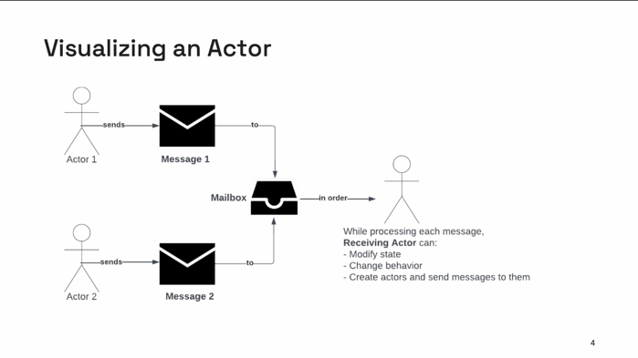
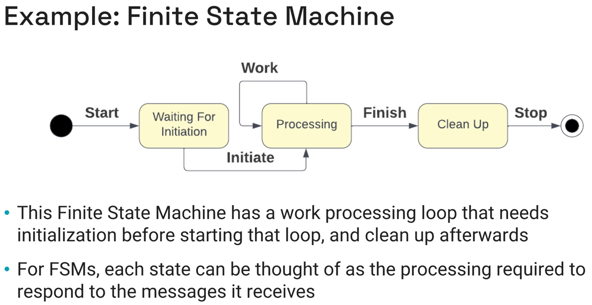
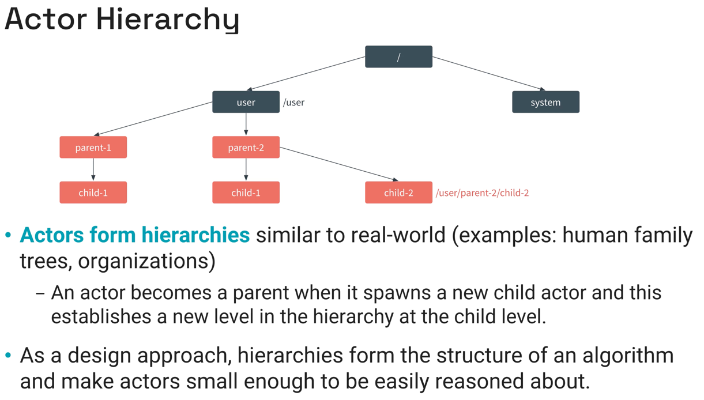
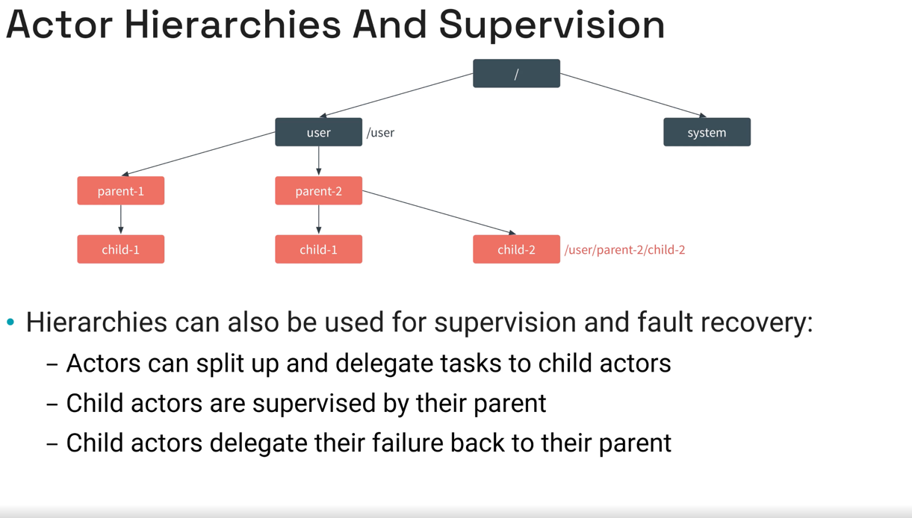

# Actor Model

### Invention of Actor

"The actor is the fundamental unit of computation embodying processing, storage, and communication"

Invented by Carl Hewitt in 1973

### Influences

- Physics 
- 1930 Lambda calculus of Alonzo Church 

### Fundamental concepts

#### An Actor

- Is the computational entity in the Actor Model 
- Has an address other use to send messages to it
- Receives messages and process them one at the time
- Communicate with other Actors by sending them messages

#### When an Actor process a message, it can 

- Change its state
- Change its behavior for handling the next message
- Create new actors
- Send or schedule messages to itself or other actors
- terminate

When an actor is not processing a message, it is idle.

## Actor anatomy 


### Messages

- Are the input and output data 
- Must be immutable
- From the Actors API
- Are typically record, struct or value object shaped

### Mailbox

- Every actor has as in-memory mailbox
- Configurable mailbox
  - Max number of messages
  - Message priority 
  - Delivery order
  - Enqueueing behavior (Blocking/non-blocking)

### State

- An actor may have state that can be mutated in a safe way:
  - Actor itself can only access state during message processing
  - Other actor can only request state by sending a message
- State typically ephemeral (in memory) / optionally persisted 
- Behavior can be type-safe (The compiler will enforce correctness by detecting wrong type of messages sent and allow us to refactor with confidence)


### What behaviors can do?

While processing the current message, a Behavor may:
- **Update the state** of the actor
- **create** one or more **actor**
- **Send a message** to any actor to which it has a reference (In actor state or in the current message)
  - **Change the active behavior**

## Actor Mutation

### State mutation

- Actor may have **mutable state** which: 
  - Can have **any structure**
  - **forbid concurrent access and mutation** by design (There is no need of look, synchronization or mutex)
  - Can be **different for each behavior** of the same actor
- Caution
  - Never share mutable state
  - Never directly access an actor´s state
  - Accessing state must happen through **sending messages**

### Behavior mutation

- While processing a message, actors can specify a different behavior for subsequent messages
- This behavior mutation, allows actors to:
  - Represent finite state machines
    - Respond differently to changes in an input stream of messages
    - support mode changes based on system state notifications
    - acts as queues that buffer input and them batch output 
    - Respond to queries differently at different times of day

### Actors creation example

- Process different kinds of work separately in children
- Parallelize processing of messages across children 
- Distribute computation around a network for resilience purposes 
- Make a complex computation using independent algorithms implemented by different kinds of actors

### Actor termination

- Actor termination is expected, "Let it crash"
- Actors can only terminate themselves, or their children, directly 
- When a parent actor stops, all its children will stop too
- This is typically done with a pre-defined behavior change that stops the actor
- Actors can suggest than another actor terminate itself by sending a message like **StopProcessing** but
it is up to the receiving actor to act in accordance with the request, or not
- Some actor systems allow actors to be notified when other actors terminate

### Sending messages

- Actors can:
  - Send messages using Actor´s addresses 
  - Send messages to themselves
  - **Schedule** messages sent to themselves or other actors

### Finite State Machine 



### Defining an FSM Actor

- States are modeled as Behaviors so every FSM state coincides with an actor behavior 
- The actor´s current behavior (state) decides which message get processed and which are ignored (or yield errors)
- Messages processed in any given state may cause a transition to a new state which is handled by a behavior mutation 
- In FSM, the behaviors are usually named after the FSM state
- Each behavior can also provide whatever data is needed for the corresponding FSM state

## Actor system 

"One actor is no actor, they come in systems"

### What is an Actor System

- Computing entity that contains and manages:
  - a collaborating ensemble of actor in a hierarchy 
  - a fixed number of threads for processing work 
  - The actors mailboxes 
  - Computing environment and configuration information 
```
"An ActorSystem is a heavyweight structure that will allocate 1...N Threads, 
so create one per logical application"
```

### A Collaborating Ensemble of Actor (Un conjunto colaborativo de actores)

- An Actor System helps actors to collaborate:
  - Break work down into concise, distinct, manageable pieces
  - Execute portions of an algorithm in parallel 
  - Implement the steps of a process or saga 
- Can define multiple ActorSystems to separate different categories of work 
- Typically, one Actor System per type of microservice

### Actor System and Threads

- Actor System needs threads to get messages dispatched to their target actor
  - Messages should be concurrently dispatched in parallel threads
- Actor System are able to work with a fixed size pool of threads
- For efficiency, the number of threads should be no more than twice the number of CPU cores
  - This is not a golden rule, and experimentation is encouraged 

### Actor System responsibilities

- Actor systems can provide shared functionality for actors, such as: 
  - Enqueue, dequeue, and dispatch messages
  - Schedule messages to be sent later
  - Logging services to actors
  - Access to environment and configuration 
  - Transparent communication between actor systems

### Actor Hierarchy  




### Actor Hierarchy Design: Best Practices

- **Move responsibilities to children** (Simplify actors logic and state)
- **Embrace short-lived** actors, such as one-child-per-request
- **Delegate** failure-prone task to children.
- **Watch** other actor **liveness**
