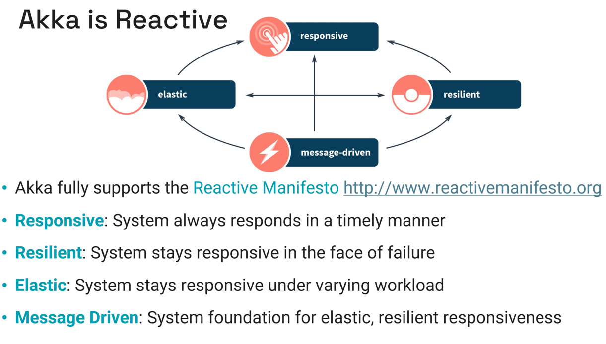
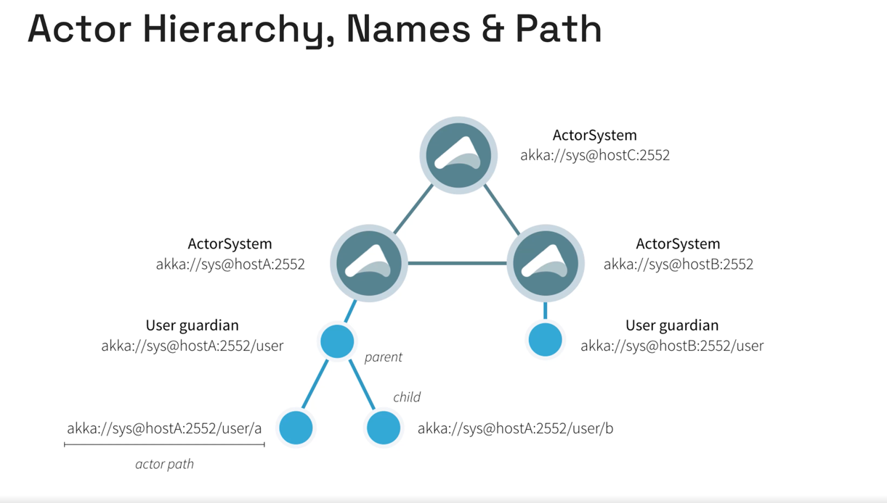
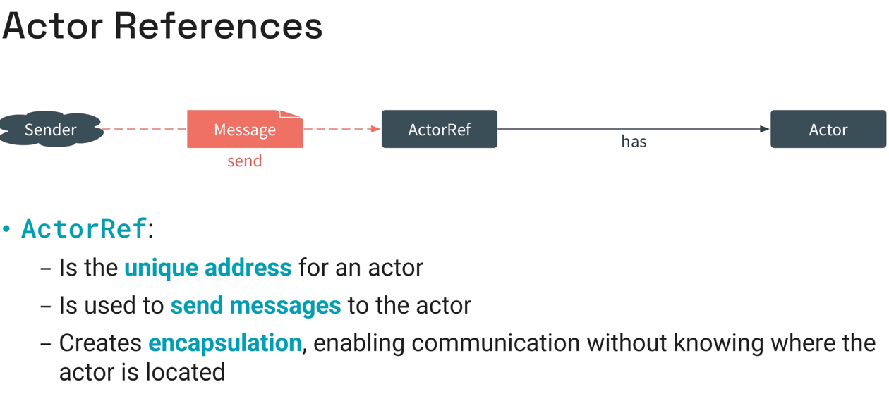
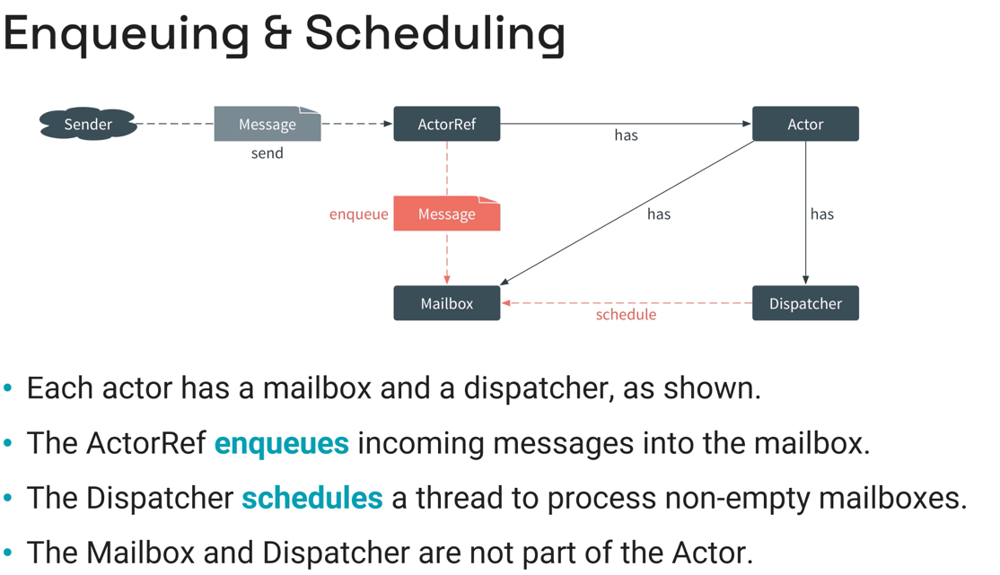
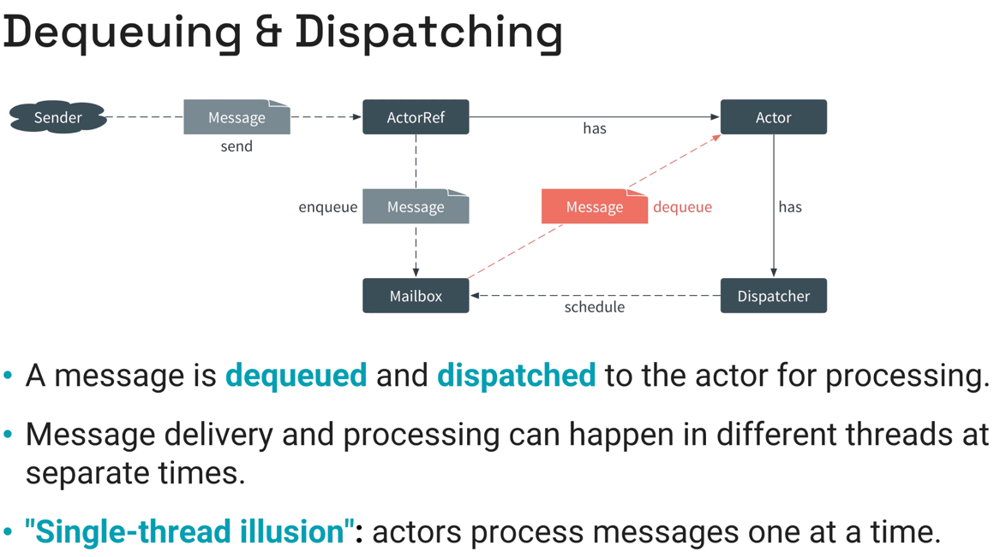

# Akka

## What is Akka

```
"Akka is a toolkit and runtime for building highly concurrent, 
distributed, fault-tolerant message-driven applications on JVM"
```



## Akka's value proposition

A single **unified** programming model for:
- simpler concurrency
- simpler distribution
- simpler fault tolerance
- simpler scalability
- enhanced performance

### simpler concurrency

- Actors let us write conde in a **single-threaded illusion**
  - No state is ever shared between multiple threads
- Consequently, no locks, synchronization points or other synchronization techniques 
are needed between threads
- This vastly simplifies software design and eliminates an entire class of 
very hard to diagnose bugs

### simpler distribution

- Akka´s **Location Transparency**
  - Everything is **distributed by default**
  - From remote to **local by optimization**
- Actors interactions use **asynchronous non-blocking** message passing 
- Scalability from single JVM to hundreds of machines

### simpler fault tolerance

- Akka **decouples** communication from failure handling
- Message passing facilitates bulk heading between components
- Akka provides a **Circuit Breaker Pattern** to minimize overloading of cooperating peer services

### simpler scalability

- **Location transparency**
- **ActorSystem can be partitioned** so that actors can run on multiple nodes of a cluster
- **Cluster Elasticity**
  - Scale up/down number of nodes to meet the load
  - Akka actors can transparently move between nodes

### enhanced performance

- Simpler coding for concurrency yields more efficient uses of CPU's:
  - Fewer JVM threads needed due to **ForkJoin executor**
  - Asynchronous I/O separated out of main application work flow
  - Asynchronous non-blocking message passing keeps CPU doing productive work
- Akka´s dispatcher can support millions of messages per seconds 
- Akka makes it easy to code for parallel computations by simply sending messages
to multiple actors


## Akka concepts

### Akka Actor System

- Akka provides an ActorSystem as a heavyweight object that:
  - Implements actor systems concepts 
  - Represent a logical and cohesive application or service
  - Contains a collaborating ensemble of actors
  - Manages the namespace of actors and their addressed 
  - Manages the mailboxes for all the collaborative actors
  - Facilitates message transmission between actors
- Manage a set of threads and dispatchers for processing work 
- Contains configuration options for the set of cooperating actors 
- Provides scheduling services for sending messages
- Provides a publish & subscribe **eventStream** for logging, unhandled messages, deal letters, etc.
- The **eventStream** is also open for user code to use

### Akka context

- An Actor doesn't live in isolation
- Additionally to its Behavior, it requires contextual information to execute
- In Akka, context is provided by an **ActorContext** object
- An **ActorContext** provides contextual features and information:
  - Access to its own identity
  - Access the **ActorSystem** to which it belongs
  - Access the Akka logging system 
- The context allows an actor to complete actions:
  - Spawn new child actors
  - Watch (observe life cycle) of child actors
  - Schedule its own termination or termination of a child
  - Schedule messages to other actors



### Actor supervision 

- Parent actors supervise their children
- Supervision defines how a parent actor responds to exceptions from its children
- There are several supervision strategies to choose from
- The default supervision strategy is to **stop** the failing child
- Other strategies:
  - Restart
  - Resume
  - Restart with limits
- Supervision also includes processing  signals (PreStart, PostStart, PreRestart, ChildFailed)







### Typed vs Classic Actors

- Akka implements two kinds  of actors: **Typed** and **Classic**
- **Classic** actors are not typesafe
  - You can send an actor messages of any type
- **Typed** actors **are typesafe**
  - You can constrain the set of messages that can be sent to an actor